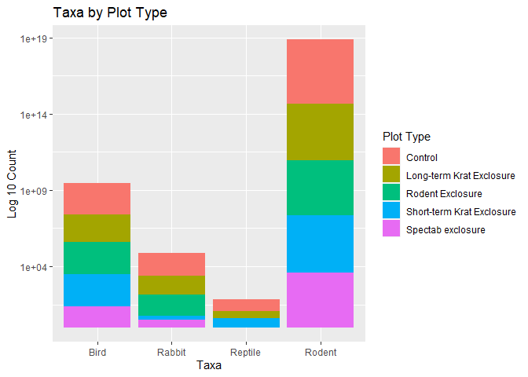
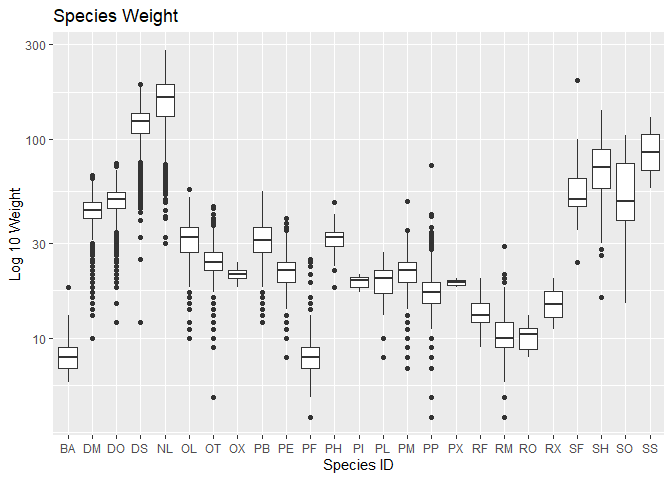
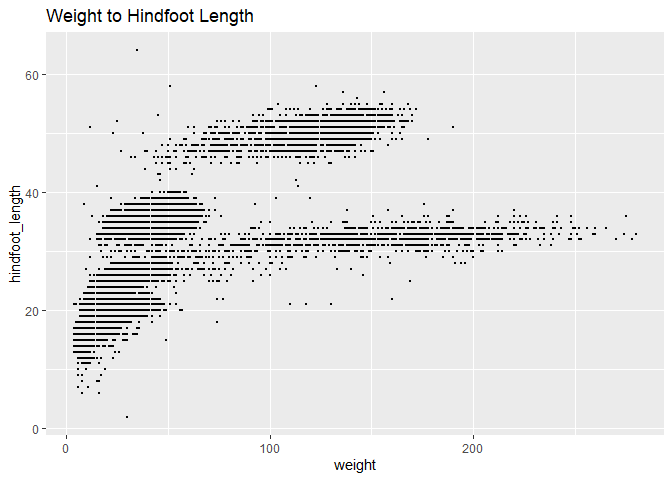
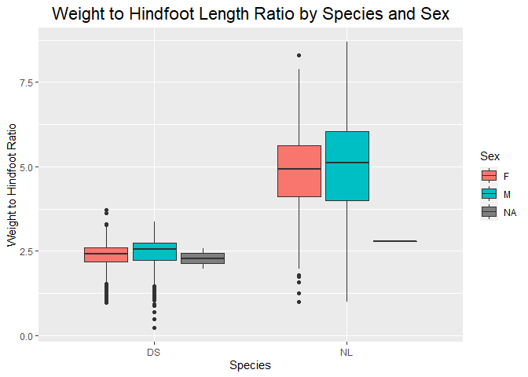
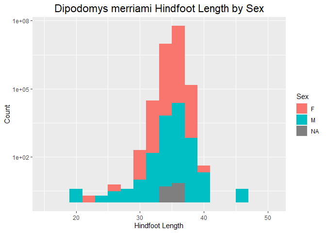

## Instructions
Answer the following questions and complete the exercises in RMarkdown. Please embed all of your code and push your final work to your repository. Your final lab report should be organized, clean, and run free from errors. Remember, you must remove the `#` for the included code chunks to run. Be sure to add your name to the author header above. For any included plots, make sure they are clearly labeled. You are free to use any plot type that you feel best communicates the results of your analysis.  

Make sure to use the formatting conventions of RMarkdown to make your report neat and clean!  

## Load the libraries

```r
library(tidyverse)
library(janitor)
library(here)
library(naniar)
```

## Desert Ecology
For this assignment, we are going to use a modified data set on [desert ecology](http://esapubs.org/archive/ecol/E090/118/). The data are from: S. K. Morgan Ernest, Thomas J. Valone, and James H. Brown. 2009. Long-term monitoring and experimental manipulation of a Chihuahuan Desert ecosystem near Portal, Arizona, USA. Ecology 90:1708.

```r
deserts <- read_csv(here("lab10", "data", "surveys_complete.csv"))
```

```
## 
## -- Column specification --------------------------------------------------------
## cols(
##   record_id = col_double(),
##   month = col_double(),
##   day = col_double(),
##   year = col_double(),
##   plot_id = col_double(),
##   species_id = col_character(),
##   sex = col_character(),
##   hindfoot_length = col_double(),
##   weight = col_double(),
##   genus = col_character(),
##   species = col_character(),
##   taxa = col_character(),
##   plot_type = col_character()
## )
```

1. Use the function(s) of your choice to get an idea of its structure, including how NA's are treated. Are the data tidy?  

```r
glimpse(deserts)
```

```
## Rows: 34,786
## Columns: 13
## $ record_id       <dbl> 1, 2, 3, 4, 5, 6, 7, 8, 9, 10, 11, 12, 13, 14, 15, ...
## $ month           <dbl> 7, 7, 7, 7, 7, 7, 7, 7, 7, 7, 7, 7, 7, 7, 7, 7, 7, ...
## $ day             <dbl> 16, 16, 16, 16, 16, 16, 16, 16, 16, 16, 16, 16, 16,...
## $ year            <dbl> 1977, 1977, 1977, 1977, 1977, 1977, 1977, 1977, 197...
## $ plot_id         <dbl> 2, 3, 2, 7, 3, 1, 2, 1, 1, 6, 5, 7, 3, 8, 6, 4, 3, ...
## $ species_id      <chr> "NL", "NL", "DM", "DM", "DM", "PF", "PE", "DM", "DM...
## $ sex             <chr> "M", "M", "F", "M", "M", "M", "F", "M", "F", "F", "...
## $ hindfoot_length <dbl> 32, 33, 37, 36, 35, 14, NA, 37, 34, 20, 53, 38, 35,...
## $ weight          <dbl> NA, NA, NA, NA, NA, NA, NA, NA, NA, NA, NA, NA, NA,...
## $ genus           <chr> "Neotoma", "Neotoma", "Dipodomys", "Dipodomys", "Di...
## $ species         <chr> "albigula", "albigula", "merriami", "merriami", "me...
## $ taxa            <chr> "Rodent", "Rodent", "Rodent", "Rodent", "Rodent", "...
## $ plot_type       <chr> "Control", "Long-term Krat Exclosure", "Control", "...
```

```r
naniar::miss_var_summary(deserts)
```

```
## # A tibble: 13 x 3
##    variable        n_miss pct_miss
##    <chr>            <int>    <dbl>
##  1 hindfoot_length   3348     9.62
##  2 weight            2503     7.20
##  3 sex               1748     5.03
##  4 record_id            0     0   
##  5 month                0     0   
##  6 day                  0     0   
##  7 year                 0     0   
##  8 plot_id              0     0   
##  9 species_id           0     0   
## 10 genus                0     0   
## 11 species              0     0   
## 12 taxa                 0     0   
## 13 plot_type            0     0
```

```r
deserts
```

```
## # A tibble: 34,786 x 13
##    record_id month   day  year plot_id species_id sex   hindfoot_length weight
##        <dbl> <dbl> <dbl> <dbl>   <dbl> <chr>      <chr>           <dbl>  <dbl>
##  1         1     7    16  1977       2 NL         M                  32     NA
##  2         2     7    16  1977       3 NL         M                  33     NA
##  3         3     7    16  1977       2 DM         F                  37     NA
##  4         4     7    16  1977       7 DM         M                  36     NA
##  5         5     7    16  1977       3 DM         M                  35     NA
##  6         6     7    16  1977       1 PF         M                  14     NA
##  7         7     7    16  1977       2 PE         F                  NA     NA
##  8         8     7    16  1977       1 DM         M                  37     NA
##  9         9     7    16  1977       1 DM         F                  34     NA
## 10        10     7    16  1977       6 PF         F                  20     NA
## # ... with 34,776 more rows, and 4 more variables: genus <chr>, species <chr>,
## #   taxa <chr>, plot_type <chr>
```

```r
#The data seems tidy to me!
```

2. How many genera and species are represented in the data? What are the total number of observations? Which species is most/ least frequently sampled in the study?

```r
deserts %>% 
  summarize(n_distinct(species_id), n_distinct(genus), n())
```

```
## # A tibble: 1 x 3
##   `n_distinct(species_id)` `n_distinct(genus)` `n()`
##                      <int>               <int> <int>
## 1                       48                  26 34786
```

```r
deserts$species_id <- as.factor(deserts$species_id)
```

```r
deserts %>% 
  select(species_id) %>% 
  count(species_id) %>% 
  arrange(desc(n))
```

```
## # A tibble: 48 x 2
##    species_id     n
##    <fct>      <int>
##  1 DM         10596
##  2 PP          3123
##  3 DO          3027
##  4 PB          2891
##  5 RM          2609
##  6 DS          2504
##  7 OT          2249
##  8 PF          1597
##  9 PE          1299
## 10 NL          1252
## # ... with 38 more rows
```

3. What is the proportion of taxa included in this study? Show a table and plot that reflects this count.

```r
deserts$taxa <- as.factor(deserts$taxa)
```


```r
deserts %>% 
  tabyl(taxa)
```

```
##     taxa     n      percent
##     Bird   450 0.0129362387
##   Rabbit    75 0.0021560398
##  Reptile    14 0.0004024608
##   Rodent 34247 0.9845052607
```

```r
deserts %>% 
  ggplot(aes(x=taxa))+geom_bar()+scale_y_log10()+labs(title="Taxa count", x="Taxa", y="Log Count")
```

<!-- -->

```r
#I realize this doesn't include proportion so I am including a second plot. 
```

```r
deserts %>% 
  tabyl(taxa) %>% 
  ggplot(aes(x=taxa, y= percent))+geom_col()
```

<!-- -->

4. For the taxa included in the study, use the fill option to show the proportion of individuals sampled by `plot_type.`

```r
deserts %>% 
  ggplot(aes(x=taxa, fill=plot_type))+geom_bar()+scale_y_log10()+labs(title= "Taxa by Plot Type", x= "Taxa", y="Log 10 Count", fill= "Plot Type")
```

<!-- -->

5. What is the range of weight for each species included in the study? Remove any observations of weight that are NA so they do not show up in the plot.

```r
deserts %>% 
  select(weight, species_id) %>% 
  group_by(species_id) %>% 
  filter(weight!="NA") %>% 
  ggplot(aes(x=species_id, y=weight))+geom_boxplot()+scale_y_log10()+labs(title="Species Weight", x="Species ID", y="Log 10 Weight")
```

<!-- -->
<style>
div.blue { background-color:#e6f0ff; border-radius: 5px; padding: 20px;}
</style>
<div class = "blue">

6. Add another layer to your answer from #4 using `geom_point` to get an idea of how many measurements were taken for each species.

```r
deserts%>%
group_by(species)%>%
filter(weight!="NA")%>%
count(species_id)%>%
ggplot(aes(x=species_id,y=n))+
geom_point(size=3)+
theme(axis.text.x = element_text(angle = 60, hjust = 1))+
labs(title = "Weight Measurements per Species",x="Species",y="Number of Weight Measurements")
```

<!-- -->
</div>

7. [Dipodomys merriami](https://en.wikipedia.org/wiki/Merriam's_kangaroo_rat) is the most frequently sampled animal in the study. How have the number of observations of this species changed over the years included in the study?

```r
deserts %>% 
  select(species_id, year) %>% 
  filter(species_id=="DM") %>% 
  group_by(year) %>% 
  summarize(n=n()) %>% 
  ggplot(aes(x=year, y=n))+geom_col()+labs(title="Number of Dipodomys merriami Observations Per Year", x="Year", y="Observations")
```

<!-- -->

8. What is the relationship between `weight` and `hindfoot` length? Consider whether or not over plotting is an issue.

```r
deserts %>% 
  select(weight, hindfoot_length) %>% 
  filter(weight!="NA") %>% 
  ggplot(aes(x=weight, y=hindfoot_length))+geom_point(size=.5)+labs(title="Weight to Hindfoot Length")
```

```
## Warning: Removed 1545 rows containing missing values (geom_point).
```

<!-- -->

```r
#seems like overplotting is an issue,
```

9. Which two species have, on average, the highest weight? Once you have identified them, make a new column that is a ratio of `weight` to `hindfoot_length`. Make a plot that shows the range of this new ratio and fill by sex.

```r
deserts %>% 
  select(species_id, weight) %>% 
  filter(weight!="NA") %>% 
  group_by(species_id) %>% 
  summarize(mean_weight=mean(weight)) %>% 
  arrange(desc(mean_weight))
```

```
## # A tibble: 25 x 2
##    species_id mean_weight
##    <fct>            <dbl>
##  1 NL               159. 
##  2 DS               120. 
##  3 SS                93.5
##  4 SH                73.1
##  5 SF                58.9
##  6 SO                55.4
##  7 DO                48.9
##  8 DM                43.2
##  9 PB                31.7
## 10 OL                31.6
## # ... with 15 more rows
```

```r
#NL (Neotoma	albigula) and DS (Dipodomys	spectabilis) have the highest mean weights!
```

```r
deserts %>% 
  select(species_id, weight, hindfoot_length, sex) %>% 
  filter(species_id=="NL"|species_id=="DS") %>% 
  filter(weight!="NA") %>% 
  filter(hindfoot_length!="NA") %>% 
  mutate(w_h_ratio=weight/hindfoot_length) %>% 
  ggplot(aes(x=species_id, y=w_h_ratio, fill=sex))+geom_boxplot()+
    labs(title= "Weight to Hindfoot Length Ratio by Species and Sex", x= "Species", y= "Weight to Hindfoot Ratio", fill= "Sex")+
    theme(plot.title = element_text(size = rel(1.5), hjust = 0.5))
```

<!-- -->

```r
deserts
```

```
## # A tibble: 34,786 x 13
##    record_id month   day  year plot_id species_id sex   hindfoot_length weight
##        <dbl> <dbl> <dbl> <dbl>   <dbl> <fct>      <chr>           <dbl>  <dbl>
##  1         1     7    16  1977       2 NL         M                  32     NA
##  2         2     7    16  1977       3 NL         M                  33     NA
##  3         3     7    16  1977       2 DM         F                  37     NA
##  4         4     7    16  1977       7 DM         M                  36     NA
##  5         5     7    16  1977       3 DM         M                  35     NA
##  6         6     7    16  1977       1 PF         M                  14     NA
##  7         7     7    16  1977       2 PE         F                  NA     NA
##  8         8     7    16  1977       1 DM         M                  37     NA
##  9         9     7    16  1977       1 DM         F                  34     NA
## 10        10     7    16  1977       6 PF         F                  20     NA
## # ... with 34,776 more rows, and 4 more variables: genus <chr>, species <chr>,
## #   taxa <fct>, plot_type <chr>
```

10. Make one plot of your choice! Make sure to include at least two of the aesthetics options you have learned.

```r
deserts %>% 
  filter(species_id=="DM") %>% 
  select(species_id, hindfoot_length, sex) %>% 
  filter(hindfoot_length!="NA") %>% 
  ggplot(aes(x=hindfoot_length, fill=sex))+geom_histogram(binwidth=2)+
  labs(title= "Dipodomys merriami Hindfoot Length by Sex", x= "Hindfoot Length", y="Count", fill="Sex")+
  scale_y_log10()+ theme(plot.title = element_text(size = rel(1.5), hjust = 0.5))
```

```
## Warning: Transformation introduced infinite values in continuous y-axis
```

```
## Warning: Removed 25 rows containing missing values (geom_bar).
```

<!-- -->

## Push your final code to GitHub!
Please be sure that you check the `keep md` file in the knit preferences. 
