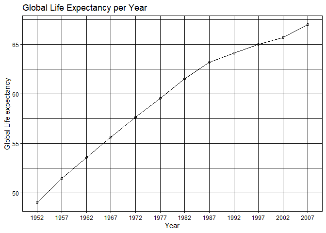
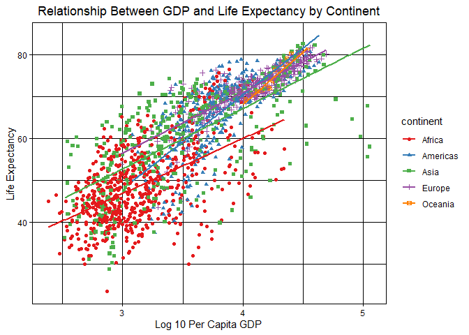

## Instructions
Answer the following questions and complete the exercises in RMarkdown. Please embed all of your code and push your final work to your repository. Your final lab report should be organized, clean, and run free from errors. Remember, you must remove the `#` for the included code chunks to run. Be sure to add your name to the author header above. For any included plots, make sure they are clearly labeled. You are free to use any plot type that you feel best communicates the results of your analysis.  

**In this homework, you should make use of the aesthetics you have learned. It's OK to be flashy!**

Make sure to use the formatting conventions of RMarkdown to make your report neat and clean!  

## Load the libraries

```r
library(tidyverse)
library(janitor)
library(here)
library(naniar)
```

## Resources
The idea for this assignment came from [Rebecca Barter's](http://www.rebeccabarter.com/blog/2017-11-17-ggplot2_tutorial/) ggplot tutorial so if you get stuck this is a good place to have a look.  

## Gapminder
For this assignment, we are going to use the dataset [gapminder](https://cran.r-project.org/web/packages/gapminder/index.html). Gapminder includes information about economics, population, and life expectancy from countries all over the world. You will need to install it before use. This is the same data that we will use for midterm 2 so this is good practice.

```r
#install.packages("gapminder")
library("gapminder")
```

## Questions
The questions below are open-ended and have many possible solutions. Your approach should, where appropriate, include numerical summaries and visuals. Be creative; assume you are building an analysis that you would ultimately present to an audience of stakeholders. Feel free to try out different `geoms` if they more clearly present your results.  

**1. Use the function(s) of your choice to get an idea of the overall structure of the data frame, including its dimensions, column names, variable classes, etc. As part of this, determine how NA's are treated in the data.**  

```r
gapminder
```

```
## # A tibble: 1,704 x 6
##    country     continent  year lifeExp      pop gdpPercap
##    <fct>       <fct>     <int>   <dbl>    <int>     <dbl>
##  1 Afghanistan Asia       1952    28.8  8425333      779.
##  2 Afghanistan Asia       1957    30.3  9240934      821.
##  3 Afghanistan Asia       1962    32.0 10267083      853.
##  4 Afghanistan Asia       1967    34.0 11537966      836.
##  5 Afghanistan Asia       1972    36.1 13079460      740.
##  6 Afghanistan Asia       1977    38.4 14880372      786.
##  7 Afghanistan Asia       1982    39.9 12881816      978.
##  8 Afghanistan Asia       1987    40.8 13867957      852.
##  9 Afghanistan Asia       1992    41.7 16317921      649.
## 10 Afghanistan Asia       1997    41.8 22227415      635.
## # … with 1,694 more rows
```

```r
summary(gapminder)
```

```
##         country        continent        year         lifeExp     
##  Afghanistan:  12   Africa  :624   Min.   :1952   Min.   :23.60  
##  Albania    :  12   Americas:300   1st Qu.:1966   1st Qu.:48.20  
##  Algeria    :  12   Asia    :396   Median :1980   Median :60.71  
##  Angola     :  12   Europe  :360   Mean   :1980   Mean   :59.47  
##  Argentina  :  12   Oceania : 24   3rd Qu.:1993   3rd Qu.:70.85  
##  Australia  :  12                  Max.   :2007   Max.   :82.60  
##  (Other)    :1632                                                
##       pop              gdpPercap       
##  Min.   :6.001e+04   Min.   :   241.2  
##  1st Qu.:2.794e+06   1st Qu.:  1202.1  
##  Median :7.024e+06   Median :  3531.8  
##  Mean   :2.960e+07   Mean   :  7215.3  
##  3rd Qu.:1.959e+07   3rd Qu.:  9325.5  
##  Max.   :1.319e+09   Max.   :113523.1  
## 
```

```r
glimpse(gapminder)
```

```
## Rows: 1,704
## Columns: 6
## $ country   <fct> Afghanistan, Afghanistan, Afghanistan, Afghanistan, Afghani…
## $ continent <fct> Asia, Asia, Asia, Asia, Asia, Asia, Asia, Asia, Asia, Asia,…
## $ year      <int> 1952, 1957, 1962, 1967, 1972, 1977, 1982, 1987, 1992, 1997,…
## $ lifeExp   <dbl> 28.801, 30.332, 31.997, 34.020, 36.088, 38.438, 39.854, 40.…
## $ pop       <int> 8425333, 9240934, 10267083, 11537966, 13079460, 14880372, 1…
## $ gdpPercap <dbl> 779.4453, 820.8530, 853.1007, 836.1971, 739.9811, 786.1134,…
```

```r
naniar::miss_var_summary(gapminder)
```

```
## # A tibble: 6 x 3
##   variable  n_miss pct_miss
##   <chr>      <int>    <dbl>
## 1 country        0        0
## 2 continent      0        0
## 3 year           0        0
## 4 lifeExp        0        0
## 5 pop            0        0
## 6 gdpPercap      0        0
```

**2. Among the interesting variables in gapminder is life expectancy. How has global life expectancy changed between 1952 and 2007?**

```r
gapminder_obj <- gapminder
```

```r
gapminder_obj <- janitor::clean_names(gapminder_obj)
```

```r
gapminder_obj$year <- as.factor(gapminder_obj$year)
```

```r
gapminder_obj %>% #1952 and 2007 are already the min and max
  group_by(year) %>% 
  summarize(mean_life_year=mean(life_exp))
```

```
## `summarise()` ungrouping output (override with `.groups` argument)
```

```
## # A tibble: 12 x 2
##    year  mean_life_year
##    <fct>          <dbl>
##  1 1952            49.1
##  2 1957            51.5
##  3 1962            53.6
##  4 1967            55.7
##  5 1972            57.6
##  6 1977            59.6
##  7 1982            61.5
##  8 1987            63.2
##  9 1992            64.2
## 10 1997            65.0
## 11 2002            65.7
## 12 2007            67.0
```


```r
gapminder_obj %>% 
  group_by(year) %>% 
  summarize(mean_life_year=mean(life_exp)) %>% 
  ggplot(aes(x=year, y=mean_life_year, group=mean_life_year))+geom_point(shape=1) +
  geom_line(aes(group=1))+
  theme(axis.text.x = element_text(hjust = 1))+
  labs(title = "Global Life Expectancy per Year",
       x = "Year",
       y = "Global Life expectancy")+
  theme_linedraw()
```

```
## `summarise()` ungrouping output (override with `.groups` argument)
```

<!-- -->

**3. How do the distributions of life expectancy compare for the years 1952 and 2007?**

```r
gapminder_obj %>% 
  filter(year== "1952"| year== "2007") %>% 
  group_by(year) %>% 
  summary()
```

```
##         country       continent        year        life_exp    
##  Afghanistan:  2   Africa  :104   1952   :142   Min.   :28.80  
##  Albania    :  2   Americas: 50   2007   :142   1st Qu.:43.47  
##  Algeria    :  2   Asia    : 66   1957   :  0   Median :59.13  
##  Angola     :  2   Europe  : 60   1962   :  0   Mean   :58.03  
##  Argentina  :  2   Oceania :  4   1967   :  0   3rd Qu.:72.25  
##  Australia  :  2                  1972   :  0   Max.   :82.60  
##  (Other)    :272                  (Other):  0                  
##       pop              gdp_percap      
##  Min.   :6.001e+04   Min.   :   277.6  
##  1st Qu.:2.670e+06   1st Qu.:  1106.4  
##  Median :6.934e+06   Median :  3051.4  
##  Mean   :3.049e+07   Mean   :  7702.7  
##  3rd Qu.:2.054e+07   3rd Qu.:  8943.2  
##  Max.   :1.319e+09   Max.   :108382.4  
## 
```

```r
gapminder_obj %>% 
  filter(year== "1952"| year== "2007") %>% 
  group_by(year) %>% 
  ggplot(aes(x=year, y=life_exp))+geom_boxplot(fill="sienna1")+
  theme_linedraw()+
  theme(axis.text.x = element_text(hjust = .5))+
  theme(plot.title = element_text(size = rel(1.25), hjust = 0.5))+
  labs(title = "Global Life Expectancy Distribution",
       x = "Year",
       y = "Global Life expectancy")
```

<!-- -->

**4. Your answer above doesn't tell the whole story since life expectancy varies by region. Make a summary that shows the min, mean, and max life expectancy by continent for all years represented in the data.**


```r
gapminder_obj %>% 
  group_by(continent) %>% 
  filter(year=="1952"|year=="2007") %>% 
  summarize(min_life=min(life_exp), mean_life=mean(life_exp), max_life=max(life_exp))
```

```
## `summarise()` ungrouping output (override with `.groups` argument)
```

```
## # A tibble: 5 x 4
##   continent min_life mean_life max_life
##   <fct>        <dbl>     <dbl>    <dbl>
## 1 Africa        30        47.0     76.4
## 2 Americas      37.6      63.4     80.7
## 3 Asia          28.8      58.5     82.6
## 4 Europe        43.6      71.0     81.8
## 5 Oceania       69.1      75.0     81.2
```


```r
gapminder_obj %>% 
  group_by(continent) %>% 
  ggplot(aes(x=continent, y=life_exp))+geom_boxplot()+
  theme_linedraw()+
  theme(axis.text.x = element_text(hjust = .5))+
  theme(plot.title = element_text(size = rel(1.25), hjust = 0.5))+
  labs(title = "Life Expectancy by Continent (All Years)",
       x = "Continent",
       y = "Life Expectancy")
```

<!-- -->

**5. How has life expectancy changed between 1952-2007 for each continent?**

```r
gapminder_obj %>% 
  group_by(continent, year) %>% 
  summarize(mean_life=mean(life_exp))
```

```
## `summarise()` regrouping output by 'continent' (override with `.groups` argument)
```

```
## # A tibble: 60 x 3
## # Groups:   continent [5]
##    continent year  mean_life
##    <fct>     <fct>     <dbl>
##  1 Africa    1952       39.1
##  2 Africa    1957       41.3
##  3 Africa    1962       43.3
##  4 Africa    1967       45.3
##  5 Africa    1972       47.5
##  6 Africa    1977       49.6
##  7 Africa    1982       51.6
##  8 Africa    1987       53.3
##  9 Africa    1992       53.6
## 10 Africa    1997       53.6
## # … with 50 more rows
```

```r
gapminder_obj %>% 
  group_by(continent, year) %>% 
  summarize(mean_life=mean(life_exp)) %>% 
  ggplot(aes(x=year, y=mean_life, group=continent, color= continent)) +geom_point(shape=5)+
  geom_line()+
  theme_linedraw()+
  theme(axis.text.x = element_text(hjust = .5))+
  theme(plot.title = element_text(size = rel(1.25), hjust = 0.5))+
  labs(title = "Life Expectancy by Continent",
       x = "Continent",
       y = "Life Expectancy",
       color = "Continent")
```

```
## `summarise()` regrouping output by 'continent' (override with `.groups` argument)
```

<!-- -->

```r
#still don't know how to add custom palette....
```


**6. We are interested in the relationship between per capita GDP and life expectancy; i.e. does having more money help you live longer?**

```r
gapminder_obj %>% 
  ggplot(aes(x=log10(gdp_percap), y= life_exp, color= continent, shape=continent))+geom_point()+
  scale_color_brewer(palette = "Set1")+
  theme_linedraw()+
  theme(axis.text.x = element_text(hjust = .5))+
  theme(plot.title = element_text(size = rel(1.25), hjust = 0.5))+
  labs(title = "Relationship Between GDP and Life Expectancy by Continent",
       x = "Log 10 Per Capita GDP",
       y = "Life Expectancy")+geom_smooth(method=lm, se=F)
```

```
## `geom_smooth()` using formula 'y ~ x'
```

<!-- -->

```r
#When I rename the color legend, it splits into separate color and shape legends. Don't want that. 
```

**7. Which countries have had the largest population growth since 1952?**

```r
gapminder_growth <- gapminder %>% 
  group_by(country) %>% 
  filter(year=="1952"|year=="2007") %>% 
  mutate(pop_growth= pop-lag(pop, default=first(pop))) %>% 
  arrange(desc(pop_growth))
gapminder_growth
```

```
## # A tibble: 284 x 7
## # Groups:   country [142]
##    country       continent  year lifeExp        pop gdpPercap pop_growth
##    <fct>         <fct>     <int>   <dbl>      <int>     <dbl>      <int>
##  1 China         Asia       2007    73.0 1318683096     4959.  762419569
##  2 India         Asia       2007    64.7 1110396331     2452.  738396331
##  3 United States Americas   2007    78.2  301139947    42952.  143586947
##  4 Indonesia     Asia       2007    70.6  223547000     3541.  141495000
##  5 Brazil        Americas   2007    72.4  190010647     9066.  133408087
##  6 Pakistan      Asia       2007    65.5  169270617     2606.  127924057
##  7 Bangladesh    Asia       2007    64.1  150448339     1391.  103561480
##  8 Nigeria       Africa     2007    46.9  135031164     2014.  101912068
##  9 Mexico        Americas   2007    76.2  108700891    11978.   78556574
## 10 Philippines   Asia       2007    71.7   91077287     3190.   68638596
## # … with 274 more rows
```


**8. Use your results from the question above to plot population growth for the top five countries since 1952.**

```r
gapminder_growth %>% 
  filter(pop_growth>=133408087) %>% #I tried to do this using top_n(5, pop_growth) but was unsuccessful. Why?
  ggplot(aes(x=country, y=pop_growth))+geom_col(fill="burlywood2")+
  theme_linedraw()+
  theme(axis.text.x = element_text(hjust = .5))+
  theme(plot.title = element_text(size = rel(1.25), hjust = 0.5))+
  labs(title = "Countries with Largest Population Growth",
       x = "Country",
       y = "Population Growth (1952-2007)")
```

<!-- -->

**9. How does per-capita GDP growth compare between these same five countries?**

```r
gapminder_growth %>% 
  filter(pop_growth>=133408087) %>% 
  ggplot(aes(x=country, y=gdpPercap))+geom_col(fill="palevioletred1")+
  theme_linedraw()+
  theme(axis.text.x = element_text(hjust = .5))+
  theme(plot.title = element_text(size = rel(1.25), hjust = 0.5))+
  labs(title = "GDP in Countries With Highest Population Growth",
       x = "Country",
       y = "Per Capita GDP")
```

<!-- -->

**10. Make one plot of your choice that uses faceting!**

```r
gapminder %>% 
  ggplot(aes(x=log10(pop)))+geom_density()+facet_wrap(~continent)
```

<!-- -->

## Push your final code to GitHub!
Please be sure that you check the `keep md` file in the knit preferences. 
