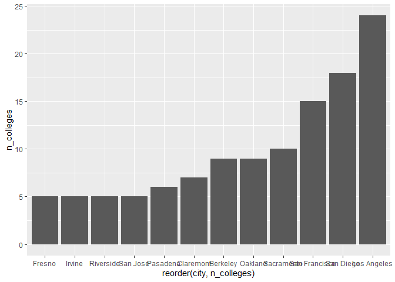
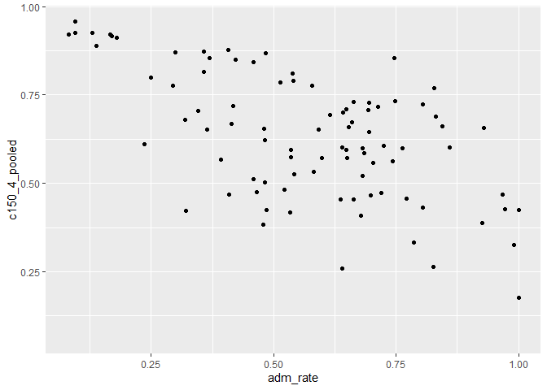
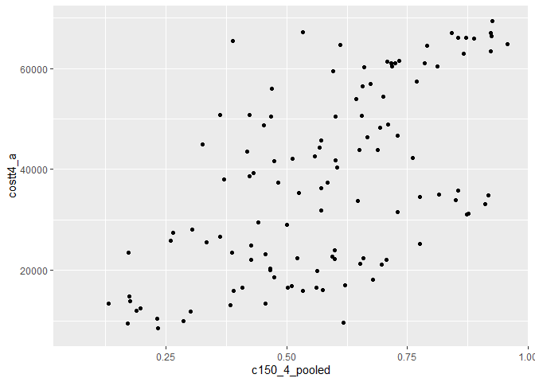
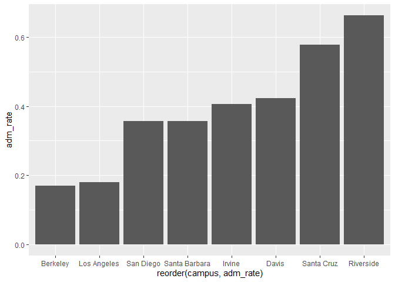
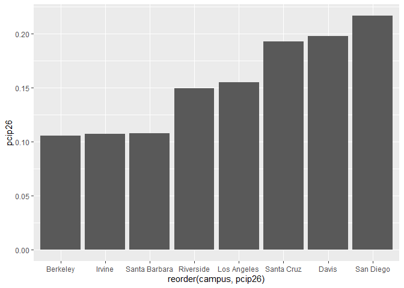

## Instructions
Answer the following questions and complete the exercises in RMarkdown. Please embed all of your code and push your final work to your repository. Your final lab report should be organized, clean, and run free from errors. Remember, you must remove the `#` for the included code chunks to run. Be sure to add your name to the author header above.  

Make sure to use the formatting conventions of RMarkdown to make your report neat and clean!  

## Load the libraries

```r
library(tidyverse)
library(janitor)
library(here)
library(naniar)
```

For this homework, we will take a departure from biological data and use data about California colleges. These data are a subset of the national college scorecard (https://collegescorecard.ed.gov/data/). Load the `ca_college_data.csv` as a new object called `colleges`.

```r
colleges <- readr::read_csv("data/ca_college_data.csv")
```

```
## 
## ── Column specification ────────────────────────────────────────────────────────
## cols(
##   INSTNM = col_character(),
##   CITY = col_character(),
##   STABBR = col_character(),
##   ZIP = col_character(),
##   ADM_RATE = col_double(),
##   SAT_AVG = col_double(),
##   PCIP26 = col_double(),
##   COSTT4_A = col_double(),
##   C150_4_POOLED = col_double(),
##   PFTFTUG1_EF = col_double()
## )
```

```r
colleges
```

```
## # A tibble: 341 x 10
##    INSTNM CITY  STABBR ZIP   ADM_RATE SAT_AVG PCIP26 COSTT4_A C150_4_POOLED
##    <chr>  <chr> <chr>  <chr>    <dbl>   <dbl>  <dbl>    <dbl>         <dbl>
##  1 Gross… El C… CA     9202…       NA      NA 0.0016     7956        NA    
##  2 Colle… Visa… CA     9327…       NA      NA 0.0066     8109        NA    
##  3 Colle… San … CA     9440…       NA      NA 0.0038     8278        NA    
##  4 Ventu… Vent… CA     9300…       NA      NA 0.0035     8407        NA    
##  5 Oxnar… Oxna… CA     9303…       NA      NA 0.0085     8516        NA    
##  6 Moorp… Moor… CA     9302…       NA      NA 0.0151     8577        NA    
##  7 Skyli… San … CA     9406…       NA      NA 0          8580         0.233
##  8 Glend… Glen… CA     9120…       NA      NA 0.002      9181        NA    
##  9 Citru… Glen… CA     9174…       NA      NA 0.0021     9281        NA    
## 10 Fresn… Fres… CA     93741       NA      NA 0.0324     9370        NA    
## # … with 331 more rows, and 1 more variable: PFTFTUG1_EF <dbl>
```

The variables are a bit hard to decipher, here is a key:  

INSTNM: Institution name  
CITY: California city  
STABBR: Location state  
ZIP: Zip code  
ADM_RATE: Admission rate  
SAT_AVG: SAT average score  
PCIP26: Percentage of degrees awarded in Biological And Biomedical Sciences  
COSTT4_A: Annual cost of attendance  
C150_4_POOLED: 4-year completion rate  
PFTFTUG1_EF: Percentage of undergraduate students who are first-time, full-time degree/certificate-seeking undergraduate students  

1. Use your preferred function(s) to have a look at the data and get an idea of its structure. Make sure you summarize NA's and determine whether or not the data are tidy. You may also consider dealing with any naming issues.

```r
colleges <- janitor::clean_names(colleges)
```


```r
glimpse(colleges)
```

```
## Rows: 341
## Columns: 10
## $ instnm        <chr> "Grossmont College", "College of the Sequoias", "Colleg…
## $ city          <chr> "El Cajon", "Visalia", "San Mateo", "Ventura", "Oxnard"…
## $ stabbr        <chr> "CA", "CA", "CA", "CA", "CA", "CA", "CA", "CA", "CA", "…
## $ zip           <chr> "92020-1799", "93277-2214", "94402-3784", "93003-3872",…
## $ adm_rate      <dbl> NA, NA, NA, NA, NA, NA, NA, NA, NA, NA, NA, NA, NA, NA,…
## $ sat_avg       <dbl> NA, NA, NA, NA, NA, NA, NA, NA, NA, NA, NA, NA, NA, NA,…
## $ pcip26        <dbl> 0.0016, 0.0066, 0.0038, 0.0035, 0.0085, 0.0151, 0.0000,…
## $ costt4_a      <dbl> 7956, 8109, 8278, 8407, 8516, 8577, 8580, 9181, 9281, 9…
## $ c150_4_pooled <dbl> NA, NA, NA, NA, NA, NA, 0.2334, NA, NA, NA, NA, 0.1704,…
## $ pftftug1_ef   <dbl> 0.3546, 0.5413, 0.3567, 0.3824, 0.2753, 0.4286, 0.2307,…
```


```r
naniar::miss_var_summary(colleges)
```

```
## # A tibble: 10 x 3
##    variable      n_miss pct_miss
##    <chr>          <int>    <dbl>
##  1 sat_avg          276     80.9
##  2 adm_rate         240     70.4
##  3 c150_4_pooled    221     64.8
##  4 costt4_a         124     36.4
##  5 pftftug1_ef       53     15.5
##  6 pcip26            35     10.3
##  7 instnm             0      0  
##  8 city               0      0  
##  9 stabbr             0      0  
## 10 zip                0      0
```

```r
colleges$city <- as.factor(colleges$city)
```

2. Which cities in California have the highest number of colleges?

```r
colleges %>% 
  select(city, instnm) %>% 
  group_by(city) %>% 
  summarize(n_colleges=n()) %>% 
  arrange(desc(n_colleges))
```

```
## `summarise()` ungrouping output (override with `.groups` argument)
```

```
## # A tibble: 161 x 2
##    city          n_colleges
##    <fct>              <int>
##  1 Los Angeles           24
##  2 San Diego             18
##  3 San Francisco         15
##  4 Sacramento            10
##  5 Berkeley               9
##  6 Oakland                9
##  7 Claremont              7
##  8 Pasadena               6
##  9 Fresno                 5
## 10 Irvine                 5
## # … with 151 more rows
```

3. Based on your answer to #2, make a plot that shows the number of colleges in the top 10 cities.

```r
colleges %>% 
  select(city, instnm) %>% 
  group_by(city) %>% 
  summarize(n_colleges=n()) %>% 
  top_n(10, n_colleges) %>% 
  ggplot(aes(x=reorder(city, n_colleges), y=n_colleges))+geom_col()
```

```
## `summarise()` ungrouping output (override with `.groups` argument)
```

<!-- -->

4. The column `COSTT4_A` is the annual cost of each institution. Which city has the highest average cost? Where is it located?

```r
colleges %>% 
  group_by(city) %>% 
  summarize(mean_city_cost=mean(costt4_a, na.rm=T)) %>% 
  arrange(desc(mean_city_cost))
```

```
## `summarise()` ungrouping output (override with `.groups` argument)
```

```
## # A tibble: 161 x 2
##    city                mean_city_cost
##    <fct>                        <dbl>
##  1 Claremont                    66498
##  2 Malibu                       66152
##  3 Valencia                     64686
##  4 Orange                       64501
##  5 Redlands                     61542
##  6 Moraga                       61095
##  7 Atherton                     56035
##  8 Thousand Oaks                54373
##  9 Rancho Palos Verdes          50758
## 10 La Verne                     50603
## # … with 151 more rows
```

5. Based on your answer to #4, make a plot that compares the cost of the individual colleges in the most expensive city. Bonus! Add UC Davis here to see how it compares :>).

```r
colleges %>% 
  filter(city=="Claremont"| city == "Davis") %>% 
  ggplot(aes(x=instnm, y=costt4_a))+geom_col()
```

```
## Warning: Removed 2 rows containing missing values (position_stack).
```

<!-- -->

6. The column `ADM_RATE` is the admissions rate by college and `C150_4_POOLED` is the four-year completion rate. Use a scatterplot to show the relationship between these two variables. What do you think this means?

```r
colleges %>% 
  select(instnm, adm_rate, c150_4_pooled) %>% 
  ggplot(data=colleges, mapping=aes(x=adm_rate, y=c150_4_pooled))+geom_point()
```

```
## Warning: Removed 251 rows containing missing values (geom_point).
```

<!-- -->
_There is a negative relationshio between completion rate and admission rate._

7. Is there a relationship between cost and four-year completion rate? (You don't need to do the stats, just produce a plot). What do you think this means?

```r
ggplot(data=colleges, mapping=aes(x=c150_4_pooled, y=costt4_a))+geom_point()
```

```
## Warning: Removed 225 rows containing missing values (geom_point).
```

<!-- -->

_There seems to be a positive relationship between cost and completion rate. Expensive colleges tend to encourage students to complete their degrees. Perhaps cost becomes an incentive. However, many of the colleges listed are community colleges and students there may not attend for 4 years._

8. The column titled `INSTNM` is the institution name. We are only interested in the University of California colleges. Make a new data frame that is restricted to UC institutions. You can remove `Hastings College of Law` and `UC San Francisco` as we are only interested in undergraduate institutions.

```r
uc_system <- colleges %>% 
  filter(str_detect(instnm,"University of California"))
uc_system
```

```
## # A tibble: 10 x 10
##    instnm city  stabbr zip   adm_rate sat_avg pcip26 costt4_a c150_4_pooled
##    <chr>  <fct> <chr>  <chr>    <dbl>   <dbl>  <dbl>    <dbl>         <dbl>
##  1 Unive… La J… CA     92093    0.357    1324  0.216    31043         0.872
##  2 Unive… Irvi… CA     92697    0.406    1206  0.107    31198         0.876
##  3 Unive… Rive… CA     92521    0.663    1078  0.149    31494         0.73 
##  4 Unive… Los … CA     9009…    0.180    1334  0.155    33078         0.911
##  5 Unive… Davis CA     9561…    0.423    1218  0.198    33904         0.850
##  6 Unive… Sant… CA     9506…    0.578    1201  0.193    34608         0.776
##  7 Unive… Berk… CA     94720    0.169    1422  0.105    34924         0.916
##  8 Unive… Sant… CA     93106    0.358    1281  0.108    34998         0.816
##  9 Unive… San … CA     9410…   NA          NA NA           NA        NA    
## 10 Unive… San … CA     9414…   NA          NA NA           NA        NA    
## # … with 1 more variable: pftftug1_ef <dbl>
```

```r
#str_detect is how you filter with a "contains"-like function!!!! Contains() or starts_with only works with a select function
```

Remove `Hastings College of Law` and `UC San Francisco` and store the final data frame as a new object `univ_calif_final`.

```r
univ_calif_final <- uc_system %>% 
  filter(instnm!="University of California-Hastings College of Law" & instnm!="University of California-San Francisco")
univ_calif_final
```

```
## # A tibble: 8 x 10
##   instnm city  stabbr zip   adm_rate sat_avg pcip26 costt4_a c150_4_pooled
##   <chr>  <fct> <chr>  <chr>    <dbl>   <dbl>  <dbl>    <dbl>         <dbl>
## 1 Unive… La J… CA     92093    0.357    1324  0.216    31043         0.872
## 2 Unive… Irvi… CA     92697    0.406    1206  0.107    31198         0.876
## 3 Unive… Rive… CA     92521    0.663    1078  0.149    31494         0.73 
## 4 Unive… Los … CA     9009…    0.180    1334  0.155    33078         0.911
## 5 Unive… Davis CA     9561…    0.423    1218  0.198    33904         0.850
## 6 Unive… Sant… CA     9506…    0.578    1201  0.193    34608         0.776
## 7 Unive… Berk… CA     94720    0.169    1422  0.105    34924         0.916
## 8 Unive… Sant… CA     93106    0.358    1281  0.108    34998         0.816
## # … with 1 more variable: pftftug1_ef <dbl>
```

Use `separate()` to separate institution name into two new columns "UNIV" and "CAMPUS".

```r
univ_separate <- univ_calif_final %>% 
  separate(instnm, into= c("univ", "campus"), sep = "-")
univ_separate
```

```
## # A tibble: 8 x 11
##   univ  campus city  stabbr zip   adm_rate sat_avg pcip26 costt4_a c150_4_pooled
##   <chr> <chr>  <fct> <chr>  <chr>    <dbl>   <dbl>  <dbl>    <dbl>         <dbl>
## 1 Univ… San D… La J… CA     92093    0.357    1324  0.216    31043         0.872
## 2 Univ… Irvine Irvi… CA     92697    0.406    1206  0.107    31198         0.876
## 3 Univ… River… Rive… CA     92521    0.663    1078  0.149    31494         0.73 
## 4 Univ… Los A… Los … CA     9009…    0.180    1334  0.155    33078         0.911
## 5 Univ… Davis  Davis CA     9561…    0.423    1218  0.198    33904         0.850
## 6 Univ… Santa… Sant… CA     9506…    0.578    1201  0.193    34608         0.776
## 7 Univ… Berke… Berk… CA     94720    0.169    1422  0.105    34924         0.916
## 8 Univ… Santa… Sant… CA     93106    0.358    1281  0.108    34998         0.816
## # … with 1 more variable: pftftug1_ef <dbl>
```

9. The column `ADM_RATE` is the admissions rate by campus. Which UC has the lowest and highest admissions rates? Produce a numerical summary and an appropriate plot.

```r
univ_separate %>% 
  arrange(desc(adm_rate))
```

```
## # A tibble: 8 x 11
##   univ  campus city  stabbr zip   adm_rate sat_avg pcip26 costt4_a c150_4_pooled
##   <chr> <chr>  <fct> <chr>  <chr>    <dbl>   <dbl>  <dbl>    <dbl>         <dbl>
## 1 Univ… River… Rive… CA     92521    0.663    1078  0.149    31494         0.73 
## 2 Univ… Santa… Sant… CA     9506…    0.578    1201  0.193    34608         0.776
## 3 Univ… Davis  Davis CA     9561…    0.423    1218  0.198    33904         0.850
## 4 Univ… Irvine Irvi… CA     92697    0.406    1206  0.107    31198         0.876
## 5 Univ… Santa… Sant… CA     93106    0.358    1281  0.108    34998         0.816
## 6 Univ… San D… La J… CA     92093    0.357    1324  0.216    31043         0.872
## 7 Univ… Los A… Los … CA     9009…    0.180    1334  0.155    33078         0.911
## 8 Univ… Berke… Berk… CA     94720    0.169    1422  0.105    34924         0.916
## # … with 1 more variable: pftftug1_ef <dbl>
```


```r
univ_separate %>% 
  ggplot(aes(x=reorder(campus, adm_rate), y=adm_rate))+geom_col()
```

<!-- -->

10. If you wanted to get a degree in biological or biomedical sciences, which campus confers the majority of these degrees? Produce a numerical summary and an appropriate plot.

```r
univ_separate %>% 
  arrange(desc(pcip26))
```

```
## # A tibble: 8 x 11
##   univ  campus city  stabbr zip   adm_rate sat_avg pcip26 costt4_a c150_4_pooled
##   <chr> <chr>  <fct> <chr>  <chr>    <dbl>   <dbl>  <dbl>    <dbl>         <dbl>
## 1 Univ… San D… La J… CA     92093    0.357    1324  0.216    31043         0.872
## 2 Univ… Davis  Davis CA     9561…    0.423    1218  0.198    33904         0.850
## 3 Univ… Santa… Sant… CA     9506…    0.578    1201  0.193    34608         0.776
## 4 Univ… Los A… Los … CA     9009…    0.180    1334  0.155    33078         0.911
## 5 Univ… River… Rive… CA     92521    0.663    1078  0.149    31494         0.73 
## 6 Univ… Santa… Sant… CA     93106    0.358    1281  0.108    34998         0.816
## 7 Univ… Irvine Irvi… CA     92697    0.406    1206  0.107    31198         0.876
## 8 Univ… Berke… Berk… CA     94720    0.169    1422  0.105    34924         0.916
## # … with 1 more variable: pftftug1_ef <dbl>
```


```r
univ_separate %>% 
  ggplot(aes(x=reorder(campus, pcip26), y=pcip26))+geom_col()
```

<!-- -->

## Knit Your Output and Post to [GitHub](https://github.com/FRS417-DataScienceBiologists)
